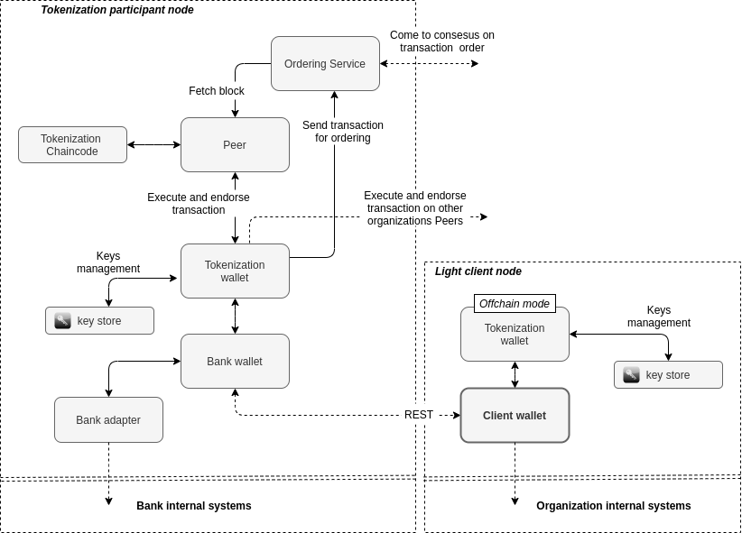

<div style="page-break-after: always;"></div>

## Abstract
The tokenization platform is permissioned blockchain network that enables participants in a trusted way to 

- register various types of tokens
- issue tokens of registered types
- atomically exchange tokens
- burn tokens

At the same time it preserves confidentiality of the token content.

<div style="page-break-after: always;"></div>

## Definition of token
The token is represented as the combination of unique ID, type, some arbitrary content and signature of this attributes by issuer. 


To guarantee uniqueness of token IDs and preserve ownership (i.e. prevent double spend) participants 
maintain a registry of mappings of unique ID to token owner public key. In order to provide ability of token 
verification participants maintain a registry of mapping from token type to issuer ID and issuer public key.
<br/>
Thus given particular token any one can:

 - verify the uniqueness of token ID and so uniqueness of the token 
 - verify the signature against issuer public key (corresponding to token type) to get confidence 
 that token is valid and issued by valid authority 

For token content to be confidential, participants have to negotiate deals using private communication channels.

<div style="page-break-after: always;"></div>

## Token types
Token types registry is a set of unique mappings from token type for issuer ID and issuer public key.

**Token type** record:

| Name	            | Type	        | Description
|---                |---            |---
|Type ID	        | **string**    | Unique type ID
|Issuer ID	        | **string**	| Participant ID of the issuer for this token type
|Issuer public key  | **bytes**     | Public key corresponding to private key by which tokens of this type should be signed

Operations:

 - **RegisterTokenType** - Registers new mapping for token type
 - **ListTokenTypes** - Queries a list of registered token types
 - **GetTokenType** - Queries token types registry for registered token type ID

<div style="page-break-after: always;"></div>

## Token IDs
Token IDs registry is a set of unique token IDs and their owners.

**Token ID** record:

| Name	| Type	        | Description
|---    |---            |---
| ID	| **string**	| Unique ID for token
| Owner	| **bytes**	    | Public key corresponding to private key of the owner for this ID


Operations:

 - **CreateTokenIDs** - Creates several unique IDs (with specified owners)
 - **GetIDOwner** - Queries for the owner of token ID
 - **MakeDeal** - Atomically change ownership of several IDs (i.e. tokens)
 - **BurnTokenID** - Burns specified token ID

<div style="page-break-after: always;"></div>

## Solution architecture
 Nowadays there are several frameworks for development of enterprise blockchain platforms.
 Following is a technical specification of implementation of tokenization platform based 
 on the [Hyperledger Fabric project](https://www.hyperledger.org/projects/fabric) from [Linux Foundation](https://www.linuxfoundation.org/).
 <br/>
 
### Transaction workflow
Typical organization node in Hyperledger Fabric  consist of several components grouped by role. The components are:

 - **Client** - an application that interacts with other blockchain component (through SDK) to produce and commit transaction.
 - **Peer** - working node that:
    - manages execution of smart contracts (*chaincode* in Fabric terminology)
    - does validation of blocks and transactions
    - maintains persisted ledger and state 
 - **Chaincode** - the smart contract itself, where the logic of application lives 
 - **Ordering service** - responsible for for consensus layer, where participants agree on the transactions and its order
<br/>


The transaction workflow consists of following steps:

 1. Client executes transaction on Peers and gather endorsements
 2. Client packs the endorsements and sends transaction to Ordering Service
 3. Once the consensus is reached, transaction includes into the block 
 4. The Peer fetches blocks from Ordering Service then verifies and applies transactions to ledger and state

<div style="page-break-after: always;"></div>

### Chaincode
The chaincode is defining what registries to maintain through implementation of operations. Following implementations are considered for tokenization platform: 

 - **Endorsement policy** - The chaincode has endorsement policy which defines minimum set of signatures from network participants that require 
for transaction to be accepted by network members. To reach full trust of blockchain technology the tokenization chaincode 
should have endorsement policy that require signs from majority of participants.

 - **Serialization format** - To minimize requirements on storage and communication overheads its desired to use binary serialization.
  The Hyperledger Fabric supports at least three languages for implementation of chaincode and client applications. To support 
all of these the [Google Protocal buffers](https://developers.google.com/protocol-buffers) is used for serialization of registry entries and requests/responses.  

 - **Cryptographic algorithms** - 256 bit Elliptic Curve DSA with 256 bit SHA algorithms are used, 
 however there is no constraints to change these (e.g. could be changed to any national standards like GOST).

<div style="page-break-after: always;"></div>

### Tokenization platform wallet
As part of the tokenization platform there is a **tokenization wallet** application that performs key management and 
plays the *Client* role in Fabric components model.


 The wallet exposes Rest API that mirrors tokenization chaincode operations.

<div style="page-break-after: always;"></div>

### Payment service
As member of the tokenization platform the Bank can register and issue tokens for their clients. 
Tokens are issued by bank for client represent this clients money.


The service exposes all operations through the REST API.

<div style="page-break-after: always;"></div>

### Payment service wallet
To simplify work with bank payment service there is a payment client wallet.



<div style="page-break-after: always;"></div>

### Use cases
This section presents common use cases for the platform.

<div style="page-break-after: always;"></div>

#### Money transfer

One of banks client transfers money to another.


<div style="page-break-after: always;"></div>

#### Atomic exchange (DVP) 

One of banks client pays with money token for some asset issued on platform.


<div style="page-break-after: always;"></div>

### Security aspects

`TODO`

### Scalability aspects

`TODO`

### Performance test results

`TODO`

<div style="page-break-after: always;"></div>

## Technical specifications
This section provides technical definitions of data structures, tokenization chaincode and wallets interfaces.  

<div style="page-break-after: always;"></div>

### Data structures
All data structures managed by tokenization chaincode are defined as  [Google Protocal buffers](https://developers.google.com/protocol-buffers) messages  
<br/>

#### Tokens
The tokens itself has to be managed privately: in private collections, in separate chain or off-chain.

#### SignedToken record
| Name          | Type          | Description                                            
|---            |---            |---
| token         | *Token*       | The token, see below
| signature     | *bytes*       | Signature for bytes representation of token, signed by token issuer. Must be verifiable against a public key registered in TokenTypes registry

Proto message:
```proto
message SignedToken {
    Token token = 1; // the token, see below
    bytes signature = 2; // signature for bytes representation of token, created by token issuer
}
```

#### Token record

| Name          | Type          | Description                                            
|---            |---            |---
| id            | *string*      | registered ID corresponding to this token
| tokenType     | *string*      | registered token type
| content       | *bytes*       | the content of token depends on type

Proto message:
```proto
message Token {
    string id = 1; // public id corresponding to this token
    string tokenType = 2; // registered token type
    bytes content = 3; // the content of token depends on type, for more details see coin.proto
}
```

#### Money token content

| Name          | Type          | Description                                            
|---            |---            |---
| target        | *string*      | who this token for
| amount        | *sint64*      | the quantity

Proto message:
```proto
// Content of token to represent disposable coin
message DisposableCoin {
    string target = 1; // who this token for
    sint64 amount = 2; // the quantity
}
```


#### TokenType record

Proto message:
```proto
// TypeID -> (Issuer ID, Issuer Public Key)
message TokenType {
    string typeID = 1; // Unique ID 
    string issuerID = 2; // Member ID of the issuer for this token type
    bytes issuerPublicKey = 3; // Public key corresponding to private key
                               // by which an token of this type should be signed 
}
```
<br/>

#### Token IDs ledger
Token IDs ledger is a set of unique token IDs and their owners.
Structure of token ID registry:
 
| Name          | Type              | Description                                            
|---            |---                |---
| ID            | *string*          | unique ID for token
| owner         | *bytes*           | Public key corresponding to private key of the owner for this ID

<br/>

#### TokenTypeList record

Proto messages:
```proto
//Wrapper for TokenType collection
message TokenTypeList {
    repeated TokenType types = 1;
}

// TokenType -> (Issuer ID, Issuer Public Key)
message TokenType {
    string typeID = 1;
    string issuerID = 2;
    bytes issuerPublicKey = 3;
}
```

#### CreateIDsRequest record
**CreateIDsRequest** 

| Name          | Type                              | Description                                            
|---            |---                                |---
| requests      |  **repeated** *TokenIDRequest*    | collection of TokenIDRequest's to process

**TokenIDRequest** 

| Name          | Type              | Description                                            
|---            |---                |---
| owner         | *bytes*           | Public key corresponding to private key of the owner for this ID
| count         | *sint32*          | count of ID to allocate for this owner key

Proto messages:
```proto
// Request to allocate token IDs
message CreateIDsRequest {
    repeated TokenIDRequest requests = 1; // list of requests to allocate IDs
}

// Request to allocate <count> of IDs for <owner>
message TokenIDRequest {
    bytes owner = 1; // public key of token owner
    sint32 count = 2; // count of IDs to allocate
}
```

**CreateIDsResponse**

| Name          | Type                               | Description                                            
|---            |---                                 |---
| requests      |  **repeated** *TokenIDResponse*    | collection of TokenIDResponse's with allocated IDs

<div style="page-break-after: always;"></div>

**TokenIDResponse**

| Name          | Type                      | Description                                            
|---            |---                        |---
| owner         | *bytes*                   | Public key corresponding to private key of the owner for this ID
| IDs           | **repeated** *string*     | count of ID to allocate for this owner key

Proto messages:
```proto
message CreateIDsResponse {
    repeated TokenIDResponse responses = 1;
}

// Response with IDs allocated for <owner>
message TokenIDResponse {
    bytes owner = 1; // public key of token owner
    repeated string IDs = 2; // the IDs
}
```

#### DealRequest record
**DealRequest** - Represents deal which is simply change of ID ownership signed by current id owners 
 
| Name       | Type                         | Description                                            
|---         |---                           |---
| deal       |  *Deal*                      | the deal
| signatures | **map** *string*->*bytes*    | map of id -> current id owner signature for the deal

Proto message:
```proto
// Atomic exchange request
message DealRequest {
    Deal deal = 1; // the deal, see @Deal
    map<string, bytes> signatures = 2; // id -> current owner id signature for the deal
}
```

**Deal** - Describes the ID ownership changes

| Name       | Type                         | Description                                            
|---         |---                           |---
| dealId     |  *bytes*                     | deal identifier for use in reporting systems
| changes    | **map** *string*->*bytes*    | map of id -> new owner public key bytes

Proto message:
```proto
message Deal {
    bytes dealId = 1; // some deal id
    map<string, bytes> changes = 2; // id -> new owner
}
```

#### BurnTokenIDRequest record
**BurnTokenIDRequest**

| Name          | Type          | Description                                            
|---            |---            |---
| id            | *string*      | ID of the token to be burned
| signature     | *bytes*       | signature of ID from current owner 

Proto message:
```proto
// Burn token
message BurnTokenIDRequest {
    string id = 1; // public ID of token
    bytes signature = 2; // signature of ID from current token owner
}
```

<div style="page-break-after: always;"></div>

### Tokenization chaincode operations

#### registerTokenType 
 Registers TokenType

| Name                  | Description                                                  
|---                    |---                       
| **Operation type**    | Invoke
| *tokenType*           | The TokenType record
| **Return**            | Either error message or "no-value" upon success


#### getTokenType
 Queries token types registry for registered token type by typeId

| Name                  | Description                                                  
|---                    |---                       
| **Operation type**    | Query
| *tokenTypeId*         | Name of token type
| **Return**            | Either error message or TokenType structure for this typeId upon success


#### listTokenTypes
 Queries list of registered token types

| Name                  | Description                                                  
|---                    |---                       
| **Operation type**    | Query
| **Return**            | Either error message or list of registered token types upon success


#### createTokenIDs
 Tries to register IDs in the IDs registry as specified by CreateIDsRequest

 | Name                  | Description                                                  
 |---                    |---                       
 | **Operation type**    | Invoke
 | *request*             | CreateIDsRequest describing how many IDs to allocate and for which owner key
 | **Return**            | Either error message or CreateIDsResponse structure containing results of allocation upon success

#### getIDOwner
 Queries for the owner of registered ID
 
 | Name                  | Description                                                  
 |---                    |---                       
 | **Operation type**    | Query
 | *id*                  | id to query for
 | **Return**            | Either error message or CreateIDsResponse structure containing results of allocation upon success
 
<div style="page-break-after: always;"></div>
 
#### makeDeal
 Tries to apply DealRequest to the IDs registry
 
 | Name                  | Description                                                  
 |---                    |---                       
 | **Operation type**    | Invoke
 | *dealRequest*         | DealRequest describing the deal
 | **Return**            | Either error message or "no-value" upon success

#### burnTokenID
 Tries to burn token id in the IDS registry
 
| Name                  | Description                                                  
|---                    |---                       
| **Operation type**    | Invoke
| *request*             | **BurnTokenIDRequest** for burn token id
| **Return**            | Either error message or "no-value" upon success
  
  
<div style="page-break-after: always;"></div>

### Tokenization wallet Rest
The wallet exposes following REST methods:

#### registerTokenType
 
Registers token type record, with this organization MSP ID as an owner.
The issuerPublicKey will be dynamically allocated and store in the wallet.
 
 | Name                  | Description                                                  
 |---                    |---                       
 | **HTTP Method**       | GET
 | **HTTP URI**          | */register-token-type*
 | *tokenType*           | name of token
 | **Return**            | Either error message or "no value" in case of success
 
#### listTokenTypes

Lists registered types of tokens

 | Name                  | Description                                                  
 |---                    |---                       
 | **HTTP Method**       | GET
 | **HTTP URI**          | */list-token-types*
 | **Return**            | Either error message or list of *TokenTypeRecord* structures

 **TokenTypeRecord**

| Name                  | Type          | Description                                            
|---                    |---            |---
| typeID                | *string*      | token type identifier
| issuerID              | *string*      | MSP ID of the issuer
| issuerPublicKey       | *string*      | Base64 encoded public key for this type of tokens 

#### issueToken
 Issue token with type and content as specified in request
 The endpoint will register an ID in the IDs registry, with *newly created key*
 then will create SignedToken (with content from request as a token)
 and sign it by key for specified token type (i.e. you must be an owner of this type).
 
 | Name                  | Description                                                  
 |---                    |---                       
 | **HTTP Method**       | POST
 | **HTTP URI**          | */issue-token*
 | **BODY**              | IssueTokenRequest structure
 | **Return**            | Either error message or Base64 encoded **SignedToken** structure

**IssueTokenRequest**

| Name                  | Type          | Description                                            
|---                    |---            |---
| key                   | *string*      | depends on method in which used: 1) for **issueToken** serves as unique operation id 2) for **issueTokenForKey** must be a Base64 encoded public key
| tokenType             | *string*      | ID of token type
| content               | *string*      | Base64 encoded body for token

<div style="page-break-after: always;"></div>

#### issueTokenForKey
 
 Issue token with type and content as specified in request
 The endpoint will register an ID in the IDs registry, with *request.key* as owner
 then will create SignedToken (with content from request as a token)
 and sign it by key for specified token type (i.e. you must be an owner of this type).
 
 | Name                  | Description                                                  
 |---                    |---                       
 | **HTTP Method**       | POST
 | **HTTP URI**          | */issue-token-for-key*
 | **BODY**              | **IssueTokenRequest** structure
 | **Return**            | Either error message or Base64 encoded **SignedToken** structure

#### createKey
 
 Creates and stores key (public/private key pair) for specified name

 | Name                  | Description                                                  
 |---                    |---                       
 | **HTTP Method**       | Get
 | **HTTP URI**          | */create-key*
 | *name*                | name of the key
 | **Return**            | Either error message or Base64 encoded bytes of public key
 
#### getPublicKey

Returns Base64 encoded bytes of public key for named key

 | Name                  | Description                                                  
 |---                    |---                       
 | **HTTP Method**       | Get
 | **HTTP URI**          | */get-public-key*
 | *name*                | name of the key
 | **Return**            | Either error message or Base64 encoded bytes of public key
 
#### assignToken

Assigns token to a named key

 | Name                  | Description                                                  
 |---                    |---                       
 | **HTTP Method**       | Get
 | **HTTP URI**          | */assign-token*
 | *name*                | name of the key
 | *signedTokenB64*      | Base64 encoded bytes of SignedToken structure
 | **Return**            | Either error message or Base64 encoded bytes of public key
 
#### eraseToken
 
 Removes token body from named key
 
 | Name                  | Description                                                  
 |---                    |---                       
 | **HTTP Method**       | Get
 | **HTTP URI**          | */erase-token*
 | *name*                | name of the key
 | **Return**            | Either error message or no-value is case of success

#### removeToken
 
 Removes token from named key
 
 | Name                  | Description                                                  
 |---                    |---                       
 | **HTTP Method**       | Get
 | **HTTP URI**          | */remove-token*
 | *name*                | name of the key
 | **Return**            | Either error message or no-value is case of success


#### listKeys
 
 Lists stored key names
 
 | Name                  | Description                                                  
 |---                    |---                       
 | **HTTP Method**       | Get
 | **HTTP URI**          | */list-keys*
 | **Return**            | Either error message or list of key names
 
#### listSignedTokens
 
 Lists tokens attached to stored keys
 
  | Name                  | Description                                                  
  |---                    |---                       
  | **HTTP Method**       | Get
  | **HTTP URI**          | */list-signed-tokens*
  | **Return**            | Either error message or list of **SignedTokenBody** structures

**SignedTokenBody**

| Name                  | Type          | Description                                            
|---                    |---            |---
| tokenId               | *string*      | ID of token
| tokenType             | *string*      | ID of token type
| tokenBody             | *string*      | Base64 encoded **SignedToken** bytes
| content               | *string*      | Base64 encoded content of **Token**


#### createDealRequest
 Creates the DealRequest structure, from the specified DealRequestTemplate.
 The DealRequest will be signed with keys specified in "outgoing" field.

  | Name                  | Description                                                  
  |---                    |---                       
  | **HTTP Method**       | POST
  | **HTTP URI**          | */create-deal-request*
  | **BODY**              | **DealRequestTemplate** structure
  | **Return**            | Either error message or Base64 encoded **DealRequest**
 
 **DealRequestTemplate**
 
 | Name         | Type                  | Description                                            
 |---           |---                    |---
 | dealId       | *string*              | ID of deal
 | outgoing     | *OutgoingToken[]*     | list of "outgoing" tokens
 | incoming     | *IncomingToken[]*     | list of "incoming" tokens

**OutgoingToken**

 | Name         | Type         | Description                                            
 |---           |---           |---
 | tokenId      | *string*     | id of token you want to spend, you must own this token
 | to           | *string*     | Base64 public key of new owner for this token

**IncomingToken**

 | Name         | Type         | Description                                            
 |---           |---           |---
 | tokenId      | *string*     | id of token you want to acquire
 | toKey        | *string*     | name of new key to deposit this token

#### verifyDealRequestSignatures
 
 Verifies signatures in DealRequest structure.
 This goes thru the signatures specified in DealRequest and verifies each
 against public key specified for id in the IDs registry. Will return **DealVerificationResult**.
 
 | Name                  | Description                                                  
 |---                    |---                       
 | **HTTP Method**       | POST
 | **HTTP URI**          | */verify-deal-signatures*
 | **BODY**              | Base64 encoded **DealRequest** structure
 | **Return**            | Either error message or list of **SignatureVerificationResult**
 
**SignatureVerificationResult**

 | Name      | Type       | Description                                            
 |---        |---         |---
 | tokenId   | *string*   | id of token
 | isValid   | *boolean*  | indicates if signature from the token id owner is valid

#### publishDeal

Tries to apply DealRequest to the IDs ledger

 | Name                  | Description                                                  
 |---                    |---                       
 | **HTTP Method**       | POST
 | **HTTP URI**          | */publish-deal*
 | **BODY**              | Base64 encoded **DealRequest** structure
 | **Return**            | Either error message or "no-value" upon success

#### addSignatureToDealRequest

Adds signature to specified **DealRequest** structure using named key
 
 | Name                  | Description                                                  
 |---                    |---                       
 | **HTTP Method**       | POST
 | **HTTP URI**          | */add-signature-to-deal*
 | **BODY**              | AddSignatureToDeal structure describing request
 | **Return**            | Either error message or updated with new signature **DealRequest** (Base64 encoded) structure

**AddSignatureToDeal**

 | Name      | Type       | Description                                            
 |---        |---         |---
 | deal      | *string*   | Base64 encoded **DealRequest** structure
 | keyName   | *string*   | name of the key for signing

<div style="page-break-after: always;"></div>

#### createBurnTokenIDRequest
 
Creates **BurnTokenIdRequest** for specified token
 
  | Name                  | Description                                                  
  |---                    |---                       
  | **HTTP Method**       | POST
  | **HTTP URI**          | */create-burn-token-id-request*
  | **BODY**              | Base64 encoded **SignedToken**
  | **Return**            | Either error message or **BurnTokenIDStruct**
  
**BurnTokenIDStruct**

 | Name                 | Type       | Description                                            
 |---                   |---         |---
 | burnTokenIDRequest   | *string*   | Base64 encoded **BurnTokenIDRequest** structure
 | tokenId              | *string*   | id of token to burn

#### burnTokenID
 
Tries to apply specified **BurnTokenIdRequest** to IDs ledger

  | Name                  | Description                                                  
  |---                    |---                       
  | **HTTP Method**       | POST
  | **HTTP URI**          | */burn-token-id*
  | **BODY**              | Base64 encoded **BurnTokenIdRequest** structure
  | **Return**            | Either error message or "no-value" upon success

<div style="page-break-after: always;"></div>

### Banking Rest endpoint
Banking REST methods:

#### listBalances
Lists balances of the client
   
   | Name                  | Description                                                  
   |---                    |---                       
   | **HTTP Method**       | GET
   | **HTTP URI**          | */list-balances*
   | **Return**            | Either error message or list of **Balance** structures
   
   **Balance** structure

   | Name                  | Type             | Description                                            
   |---                    |---               |---
   | amount                | *Long*           | amount of tokens
   | tokenType             | *String*         | name of registered type of the token 
   
  
#### getBalanceByTokenType 
Queries balance for specified token type

   | Name                  | Description                                                  
   |---                    |---                       
   | **HTTP Method**       | GET
   | **HTTP URI**          | */get-balance*
   | *tokenType*           | name of registered type of the token
   | **Return**            | Either error message or **Balance** structure in case of success
      

#### processReserveRequest
 Reserves banknote. This consist of following steps:
 
  - Registration of unique banknote ID in the **tokenization platform**
  - Issue of token signed by appropriate bank private key (corresponding to public key registered for token type in **tokenization platform**)   
  
  
   | Name                  | Description                                                  
   |---                    |---                       
   | **HTTP Method**       | GET
   | **HTTP URI**          | */make-reserve*
   | *ReserveRequest*      | ReserveRequest structure
   | **Return**            | Either error message or Base-64 encoded banknote in case of success
   
  **ReserveRequest** structure
  
   | Name                  | Type             | Description                                            
   |---                    |---               |---
   | correlationId         | *String*         | unique id of operation for tracing purpose
   | tokenType             | *String*         | name of registered type of the token 
   | amount                | *Long*           | amount of tokens
   | requester             | *String*         | requester public address base64 encoded
   | recipient             | *String*         | recipient public address base64 encoded

 <div style="page-break-after: always;"></div>
  
#### processPublishDealRequest
  Tries to apply PublishDealRequest to the ledger
  
   | Name                  | Description                                                  
   |---                    |---                       
   | **HTTP Method**       | POST
   | **HTTP URI**          | */process-publish-deal-request*
   | *request*             | PublishDealRequest structure
   | **Return**            | Either error message or "Success" in case of success
 
 
 **PublishDealRequest** structure:
 
   | Name          | Type         | Description                                            
   |---            |---           |---
   | correlationId |  *String*    | unique id of operation for tracing purpose
   | DealRequest   |  *String*    | base64 encoded *DealRequest*
  
 **DealRequest** structure 
 Represents deal which is simply a set of changes of ID ownership signed by current IDs owners 
   
   | Name       | Type                         | Description                                            
   |---         |---                           |---
   | deal       |  *Deal*                      | the deal
   | signatures | **map** *string*->*bytes*    | map of id -> current id owner signature for the deal
  
  
#### processBurnRequest
  Tries to apply burnRequest to the ledger
  
   | Name                  | Description                                                  
   |---                    |---                       
   | **HTTP Method**       | GET
   | **HTTP URI**          | */process-burn*
   | *BurnRequest*         | Burn Request structure
   | **Return**            | Either error message or "Success" is case of success

  
 **BurnRequest** structure    
          
   | Name                  | Type             | Description                                            
   |---                    |---               |---
   | correlationId         | *String*         | unique id of operation for tracing purpose
   | requester             | *String*         | MSP ID of requester
   | burnTokenIDRequest    | *String*         | Base64 encoded BurnTokenIDRequest
   | signedToken           | *String*         | Base64 encoded SignedToken
         
<div style="page-break-after: always;"></div>   
  
### Client wallet
Client wallet exposes following REST methods:

#### listBalances
 Lists balances of the client
   
   | Name                  | Description                                                  
   |---                    |---                       
   | **HTTP Method**       | GET
   | **HTTP URI**          | */list-balances*
   | **Return**            | Either error message or list of **Balance** structures
   
   **Balance** structure

   | Name                  | Type             | Description                                            
   |---                    |---               |---
   | amount                | *Long*           | amount of tokens
   | tokenType             | *String*         | name of registered type of the token 
   
  
#### getBalanceByTokenType
 Queries balance for specified token type

   | Name                  | Description                                                  
   |---                    |---                       
   | **HTTP Method**       | GET
   | **HTTP URI**          | */get-balance*
   | *tokenType*           | name of registered type of the token
   | **Return**            | Either error message or **Balance** structure in case of success


#### performReserve
 Requests banknote from the Bank
   
   | Name                  | Description                                                  
   |---                    |---                       
   | **HTTP Method**       | GET
   | **HTTP URI**          | */make-reserve*
   | *correlationId*       | unique id of operation for tracing purpose
   | *tokenType*           | name of registered type of the token
   | *amount*              | amount of tokens
   | **Return**            | Either error message or Base64 encoded banknote


#### processPublishDealRequest
 Tries to apply DealRequest to the IDs ledger through the Bank
 
   | Name                  | Description                                                  
   |---                    |---                       
   | **HTTP Method**       | POST
   | **HTTP URI**          | */process-publish-deal-request*
   | *request*             | PublishDealRequest, containing correlationId and base64 encoded DealRequest
   | **Return**            | Either error message or "Success" in case of success

<div style="page-break-after: always;"></div>
 
   **PublishDealRequest** structure:
 
   | Name          | Type         | Description                                            
   |---            |---           |---
   | correlationId |  *String*    | unique id of operation for tracing purpose
   | DealRequest   |  *String*    | base64 encoded *DealRequest*

  **DealRequest** structure 
  Represents deal which is simply change of ID ownership signed by current id owners 
  
 | Name       | Type                         | Description                                            
 |---         |---                           |---
 | deal       |  *Deal*                      | the deal
 | signatures | **map** *string*->*bytes*    | map of id -> current id owner signature for the deal
    
#### processBurn
 Requests burn of banknote from the Bank
   
 | Name                  | Description                                                  
 |---                    |---                       
 | **HTTP Method**       | GET
 | **HTTP URI**          | */process-burn*
 | *id*                  | of the BurnRequest
 | *signedTokenB64*      | Base64 encoded SignedToken
 | **Return**            | Either error message or "Success" is case of success
