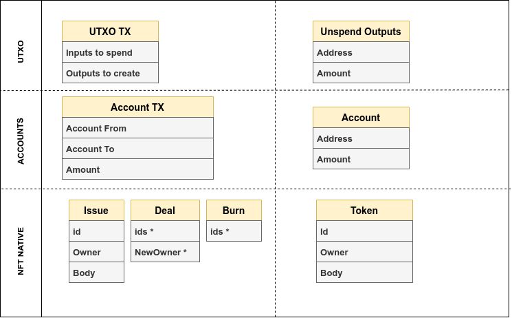

## What is blockchain

Blockchain is:

 - a storage
 - it's distributed
 - it's decentralized

  

## CAP theorem

Every distributed system follows CAP theorem:

In case of **P**artitioning your system must choose between **C**onsistency and **A**vailability

When nodes are split into groups you can:

 - stop the service and wait for connection restored i.e. be unavailable
 - do not wait and provide service, but then consistency is not guaranteed  

As distributed systems the blockchains are also can be divided to AP and CP. Design choice is naturally driven by the goal of the project:
 
 - **Public networks** - which are open, every one can join the network, thus the nodes can arrive and depart dynamically - makes focus on **Availability**
 - **Private networks** - where all participants are known and can guarantee SLAs are more value **Consistency**
 

## What is stored?
 - The log of transaction
 - Transactions grouped in blocks
 - And the blocks are linked

  

## Blockchain node

The node is basically a State Machine, which does state transition in a batched mode by processing blocks:

 

 1. Transaction is verified/pre-executed against current state
 2. Submitted to consensus layer, where nodes will agree for next block 
 3. Once block produced, transactions in block are verified/post-executed again (in the order they included in block) and applied to the State 

Main take: Transactions can be submitted in parallel while result applied to State at the **Block** level

## What is transaction

The transaction describe changes thus depend on the model of particular chain. 
There are two main models in use in crypto world:

 - **UTXO** (Bitcoin)
 - **Accounts** (Etherium)

Our platform use **NFT native** model which is basically improved version of **UTXO**

