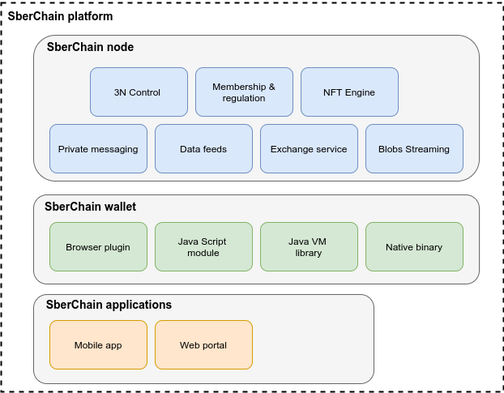

## SberChain node

### 3N Control

Node and network control service provides you API for node and network management. The service enables you to:

  - initialize and create new platform node
  - configure and scale the node
  - create new network, or
  - join existing

### Membership & regulation

Membership API:

 - register new blockchain identity
 - do regulation for existing identities

 

### NFT Engine

SberChain platform, internally, at blockchain level uses model similar to classic Bitcoin UTXO to represent assets. However, 
we extended the model to enable custom behavior for tokens,
which could be deployed as smart contract. The API allows you:

 - define and deploy parameterizable smart contract
 - create an instance of smart contract
 - issue tokens (by interacting with smart contracts)
 - exchange tokens with other participants
 - burn tokens to trigger execution of issuer obligations

 

### Data feeds

Concept of the oracles (some party that feeds external data onto the blockchain)
is supported natively on the platform. The API provided to:

 - define and register data feed
 - feed values to blockchain

 

### Private messaging

One of extended features of platform is private messaging. Any registered participant can send a message to some other. 
The message is stored on blockchain ledger encrypted, so only targeted participant(s) can see the content, 
however the fact is present to any party that has access to platform.

 

### Exchange service

We also provide an Offering board functionality where any participant can put an offer for exchange one token for another

 

### Blobs Streaming

Another feature of platform is blobs streaming - any participant can send blobs (binary files) to others

 

## SberChain wallet

Provided as:
 
 - Java Script ES6 module (suitable for use with Node.js and React native) 
 - Browser plugin (with appropriate ES6 wrapper module for embedding in web pages)
 - Java VM library (has Java, Scala and Kotlin facades)
 - Native binary (exports C ABI ?)

 

## SberChain applications

Some third layer applications are also provided:
 
 - Mobile wallet
 - Web portal

 

